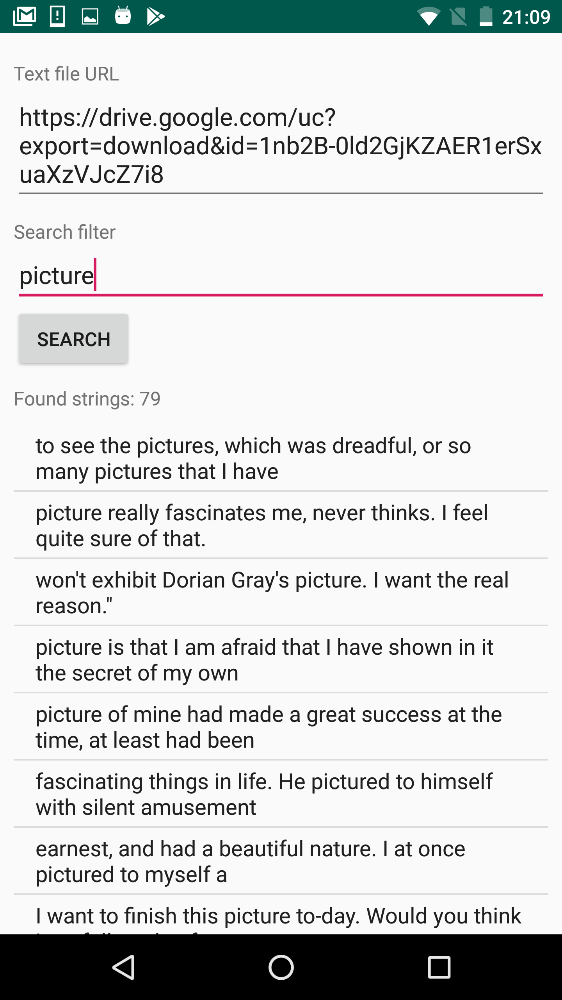

# android-text-searching-app

## Description

TextSearchingApp - Android application which performs downloading of text file and searching of text.
This is test task, it was implemented with some modifications of initial task formulation becuase it became not actual.
Not implemented filtering of text by mask using symbols "*" - any count of any characters, "?" - one arbitrary character.
Current implementation just searches strings which contain given filter string.
Filtering of strings is implemented in native code on C++ language.

## Built application

**Built application:** [TextSearchingApp_1.0-debug.apk](https://drive.google.com/file/d/1X5DcvTWRFKzTme7WvgU102lNl1snNqDA/view?usp=sharing)

Comand to install via adb
```
adb install TextSearchingApp_1.0-debug.apk
```

## Screenshots

Main Screen



## Task formulation

Develop Android application which performs downloading of text file by given URL and searching of required text in it.
User enters URL of text file and search filter of strings and clicks button which starts downloading and then searching process.
Found strings matching search filter are added to list and displayed on screen, list is being updated during search process.
Filtering of strings should be implemented on C++ language.

## Code style

**Java Code style:** http://source.android.com/source/code-style.html

## Project info

* Minimum Android version: 4.4 (API 19)
* Programming languages: Java, C++
* Architecture: some kind of MVP
* Used libraries: Android SDK, Dagger 2, RxJava 2

## Text file URLs

[Oscar Wilde "The picture of Dorian Gray"](https://drive.google.com/uc?export=download&id=1nb2B-0ld2GjKZAER1erSxuaXzVJcZ7i8&id=1nb2B-0ld2GjKZAER1erSxuaXzVJcZ7i8)
